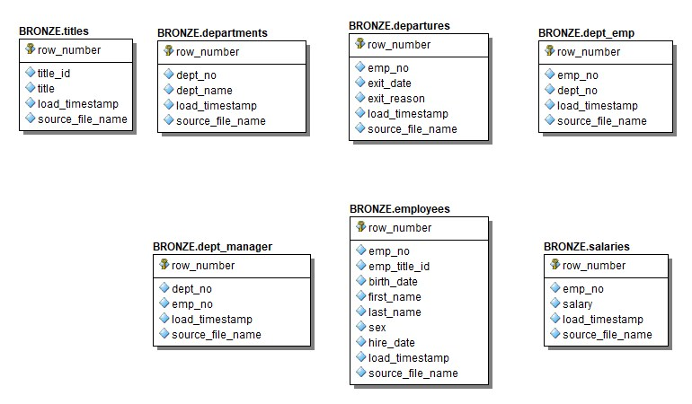
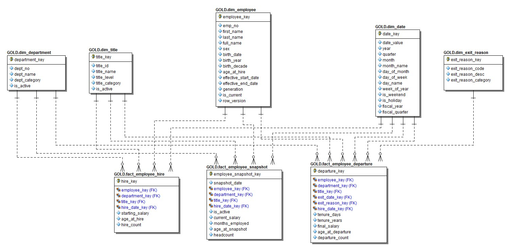

# Medallion Architecture Design

## Overview

Seven CSV files were provided as the source for the data pipeline:

- `employees.csv` (~70,098 rows)
- `departures.csv` (~31,669 rows)
- `salaries.csv` (~81,291 rows)
- `dept_emp.csv` (~126,432 rows)
- `dept_manager.csv` (~24 rows)
- `departments.csv` (~10 rows)
- `titles.csv` (~8 rows)
- 

The files were uploaded to an **Amazon S3 bucket**. Using **FiveTran**, they were synced into a **Snowflake** database, structured by the *Medallion Architecture* (Bronze, Silver, Gold, Platinum layers).
ETL and data quality were managed with **dbt**; business reporting leveraged **Tableau** dashboards built on the Platinum layer views.

***

## Layer Overview

| Layer | Key Tables | Row Counts | Major Processing Steps |
| :-- | :-- | :-- | :-- |
| **Bronze** | 7 base tables | 70k–126k (as loaded) | Raw ingest; no cleaning |
| **Silver** | 7 cleansed tables | 7k–69k (facts); 7–9 (dims) | Remove orphans, dedupe, parse, mapping |
| **Gold** | 5 dims + 3 facts | Dims: 7–69k; Facts: 7k–69k; Snapshots: ~12.5M | Star schema creation, keys, joins |
| **Platinum** | Views (agg/analysis) | N/A | Reporting queries for Tableau |

***

## ETL Steps by Layer

**Bronze → Silver:**

- Remove header/empty/null rows
- Standardize date fields
- Filter and deduplicate by `emp_no`
- Remove orphans (unmatched employees/departments)
- Map exit reason codes to descriptions
- Map department codes to names
- Assign primary department (if needed)
- Build audit/ETL metadata

**Silver → Gold:**

- Build deduplicated star-schema dimensions
- Assign surrogate keys
- Derive employee generation from birth year
- Generate monthly employee-by-month snapshots
- Map codes to human-readable labels
- Ensure referential integrity
- Add row versioning and audit columns

**Gold → Platinum (Reporting):**

- Aggregate and blend joins for dashboards
- Apply department and exit reason mappings
- Filter/label data to match dashboard requirements

***

## Entity-Relationship (ER) Diagrams

### Bronze Layer Model

### Silver Layer Model

### Gold Layer Model

***

## Medallion Architecture Flow

The process moves raw files through four distinct layers, each adding structure, quality, and analytic value:

1. **Bronze Layer:** Raw, unfiltered tables directly loaded from source files.
2. **Silver Layer:** Data cleansed, mapped, and validated.
3. **Gold Layer:** Star schema dimensions and facts for reporting, snapshot tables for trend analysis.
4. **Platinum Layer:** Business-ready views optimized for Tableau dashboards.

***

## Platinum Layer: Reporting Views

**Key output views for Tableau:**

- `vw_fluctuation_monthly_summary`:
*Headcount, hires, departures, net change, turnover rate; by month for trend/KPI cards*
- `vw_fluctuation_by_department_monthly`:
*Monthly headcount, hires, departures by department; department mapped for Tableau filters*
- `vw_departures_by_exit_reason_monthly`:
*Departure counts by month and exit reason; supports charts and filter choices*
- `vw_current_employee_snapshot`:
*Current active roster; used for filter population (department, title, generation)*
- `vw_turnover_by_department`:
*Departures, headcount, turnover % by department; drives departmental analysis*

***

## Data Dictionary \& Modeling Highlights

### Dimensions

- **Employee:** `emp_no`, name fields, sex, birth/hire dates, generation attributes, validity indicators
- **Department:** `dept_no`, name, category, status
- **Title:** `title_id`, name, category, level
- **Exit Reason:** code, description, category
- **Date:** key fields, value, day/month/year attributes, holidays

### Facts

- **Employee Snapshot:** Monthly employment status, headcount, active flags, salary states
- **Employee Hire:** New hires, starting salary, age, department/title/dates
- **Employee Departure:** Departures by reason, tenure, final salary, exit date

***

## Project Notes

- Diagrams are provided as image references for clarity and GitHub rendering.
- All transformations are fully documented in dbt scripts, and audit columns are maintained throughout each stage.
- Data modeling emphasizes referential integrity, deduplication, and readiness for business KPIs and dashboarding.
